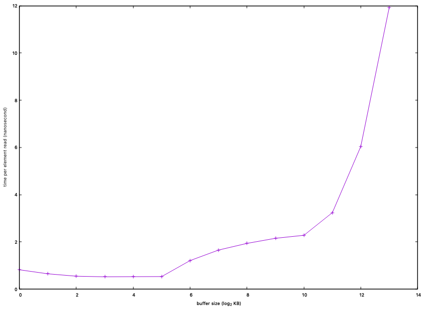

## Part 1
The benchmark measures the per element reading time of vectors (served as our buffer) with 2^8 (1KB) to 2^21(8192KB) 32-bit integers.
To measure the desired metric, each vector of size `n` is read in a random order. The order of reading is implemented by a vector with non-repeating 0 - n-1 in it and is shuffled.
Then the benchmark iterates over the random index vector and increment the j-th element of the buffer if the current element in the random index vector is `j`.
The time it takes to iterate over the random index vector and read the according elements in the buffer is timed with c++'s `high_resolution_clock` and averaged over the totaled number of iterations before being printed in the console.
The random reading order is designed to disrupt the temporal and spatial locality of ordinary code, thus, preventing the computer from prefetching data in the buffer into lower cache levels they are originally located;
that is, the buffer would stay in the level of cache that is big enough to accomodate it. Although the random index buffer would take up space in cache, its behavior would be regular.
Since we are reading it by order, it would have a strong spatial locality, which means the computer is highly likely to allocate the indexes we need to read from in the fastest level of cache.
This means that the per element reading time of the random index vector would stay constant as its size grows. Thus, the change in time we measured would solely reflect the change in the per element time of the buffer.
The system clock does not have a fine enough granularity to time a single read from the buffer; we have to time the total time to read every single element of the buffer.
The problem is that the OS might interrupt our process and the time while the program is on halt would be part of the measured time. To resolve this issue, we time the reading of the same buffer a large number of times and choose the shortest measure as our reference.

## Part 2

